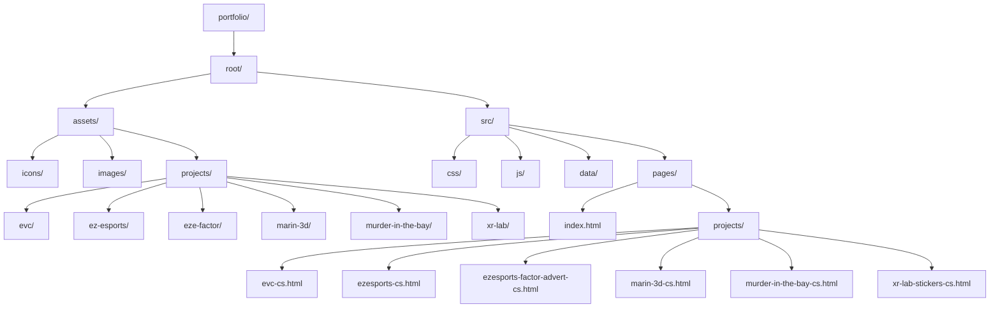

# portfolio

## Cloudflare Pages friendly structure

Your current structure works locally on Windows, but Cloudflare Pages runs on Linux and is strict about path casing and file names.
The safest pattern is:

- Keep a single publish root: `root`
- Keep all web pages in `root/src/pages`
- Keep static assets in `root/assets`
- Use lowercase + kebab-case names only
- Avoid spaces and mixed-case in folder/file names

## Rename map (high impact)

- `assets/project files` -> `assets/projects`
- `assets/project files/ez esports` -> `assets/projects/ez-esports`
- `assets/project files/xr lab` -> `assets/projects/xr-lab`
- `assets/project files/marin3D` -> `assets/projects/marin-3d`
- `src/pages/projects/XR-lab-stickers-cs.html` -> `src/pages/projects/xr-lab-stickers-cs.html`

## Why this prevents 404s

- Linux hosting treats `XR-lab-stickers-cs.html` and `xr-lab-stickers-cs.html` as different files.
- URLs with spaces require exact encoding and are easy to break.
- Cleaner naming reduces fragile relative path bugs across nested pages.

## Cloudflare Pages settings

- Build command: `(none)`
- Build output directory: `root`

If you keep HTML inside `root/src/pages`, either move deployable HTML to `root` or add a build step that copies `src/pages` into the publish root.
